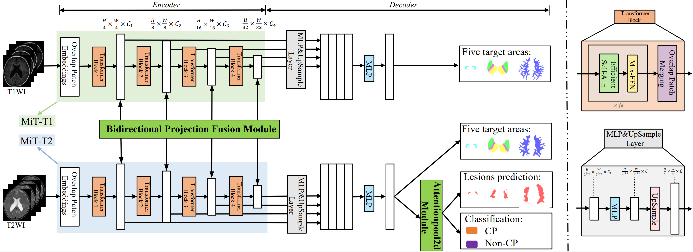
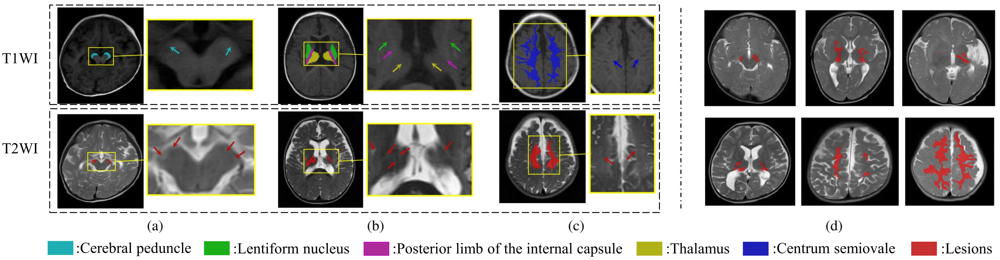

# Bidirectional Projection-Based Multi-Modal Fusion Transformer for Early Detection of Cerebral Palsy in Infants


##  1. Abstract
Periventricular white matter injury (PWMI) is the most frequent magnetic resonance imaging (MRI) finding in infants with Cerebral Palsy (CP).
We aim to detect CP and identify subtle, sparse PWMI lesions in infants under two years of age with immature brain structures.
Based on the characteristic that the responsible lesions are located within five target regions,
we first construct a multi-modal dataset including 310 cases with the mask annotations of five target regions for delineating anatomical structures on T1-Weighted Imaging (T1WI) images, masks for lesions on T2-Weighted Imaging (T2WI) images, and categories (CP or Non-CP).
Furthermore,
we develop a bidirectional projection-based multi-modal
fusion transformer (BiP-MFT), incorporating a ***Bidirectional Projection Fusion Module*** (BPFM) for integrating the features between five target regions on T1WI images and lesions on T2WI images.
Our BiP-MFT achieves subject-level classification
accuracy of 0.90, specificity of 0.87, and sensitivity of
0.94. It surpasses the best results of nine comparative
methods, with 0.10, 0.08, and 0.09 improvements in classification accuracy, specificity, and sensitivity, respectively. Our BPFM outperforms eight compared feature fusion strategies using Transformer and U-Net backbones on our dataset. Ablation studies on the dataset annotations and model components justify the effectiveness of our annotation method and the model rationality.


## 2. Architecture



## 3. Our Dataset: Infant-PWMl-CP Dataset

The PWMI-CP MRI dataset focuses on the study of periventricular white matter injury (PWMI) and its role in predicting the risk of cerebral palsy (CP) in infants. It consists of 310 MRI scan cases, including 122 infants diagnosed with PWMI (90 CP cases and 32 non-CP cases) and 188 infants with normal MRI scans as controls. The dataset includes multi-modal MRI scans, such as T1-weighted and T2-weighted imaging, acquired using 3.0T and 1.5T MRI scanners. The dataset provides annotated lesion regions using expert radiologist segmentation, making it a valuable resource for studying PWMI-related brain abnormalities and developing automated diagnostic models for CP risk assessment. The dataset documentation is available for download at the following link.


##  4. Training on our Infant-PWMl-CP Dataset

### Train

The file path "total_path", "pretrained_weight_path", and "data_path" should be changed in the `BiP-MFT-2D_Infant-PWMl-CP/train.py`.

The "total_path" is the absolute file path of "BiP-MFT-2D_Infant-PWMl-CP/".

The "pretrained_weight_path" is the weights of SegFormer pre-trained on ImageNet-1K, named "mit_b1.pth", which can be downloaded at [SegFormer](https://connecthkuhk-my.sharepoint.com/personal/xieenze_connect_hku_hk/_layouts/15/onedrive.aspx?id=%2Fpersonal%2Fxieenze%5Fconnect%5Fhku%5Fhk%2FDocuments%2Fsegformer%2Fpretrained%5Fmodels&ga=1), or our [Google Drive](https://drive.google.com/drive/folders/1yBVICW9lcDANth-RlwJy1C9M6QNXJ0L2?usp=sharing) and [Baidu Netdisk](https://pan.baidu.com/s/1XiwKp7Ayc81qefs3eu7pGg?pwd=fae8).

The "data_path" is our Infant-PWMl-CP Dataset named "Infant-PWMl-CP.zip" (2.86GB), which can be downloaded at [Google Drive](https://drive.google.com/drive/folders/1yBVICW9lcDANth-RlwJy1C9M6QNXJ0L2?usp=sharing) or [Baidu Netdisk](https://pan.baidu.com/s/1XiwKp7Ayc81qefs3eu7pGg?pwd=fae8).

### Test

The weights of our model "last_epoch_weights.pth" trained on the 0-fold data of the Infant-PWMl-CP Dataset can be downloaded at [Google Drive](https://drive.google.com/drive/folders/1yBVICW9lcDANth-RlwJy1C9M6QNXJ0L2?usp=sharing) or [Baidu Netdisk](https://pan.baidu.com/s/1XiwKp7Ayc81qefs3eu7pGg?pwd=fae8).


### Infant-PWMl-CP Dataset
The dataset document "Dataset_Documentation.pdf" can be downloaded at [Google Drive](https://drive.google.com/drive/folders/1yBVICW9lcDANth-RlwJy1C9M6QNXJ0L2?usp=sharing) or [Baidu Netdisk](https://pan.baidu.com/s/1XiwKp7Ayc81qefs3eu7pGg?pwd=fae8).
The structure of Infant-PWMl-CP should be like below:
```
Infant-PWML-CP/
|-- CP/
|   |-- 01001/
|   |   |-- case_01001_T1.nii.gz
|   |   |-- case_01001_T1_seg.nii.gz
|   |   |-- case_01001_T2.nii.gz
|   |   |-- case_01001_T2_seg.nii.gz
|   |-- 01002/
|   |-- 01003/
|   |-- ...
|   |-- 01090/
|
|-- N_CP/
|   |-- 02001/
|   |   |-- case_02001_T1.nii.gz
|   |   |-- case_02001_T1_seg.nii.gz
|   |   |-- case_02001_T2.nii.gz
|   |   |-- case_02001_T2_seg.nii.gz
|   |-- 02002/
|   |-- 02003/
|   |-- ...
|   |-- 02032/
|
|-- Normal/
|   |-- 03001/
|   |   |-- case_03001_T1.nii.gz
|   |   |-- case_03001_T1_seg.nii.gz
|   |   |-- case_03001_T2.nii.gz
|   |-- 03002/
|   |-- 03003/
|   |-- ...
|   |-- 03121/
```

The case identifiers used for the training and validation sets in each fold of the five-fold cross-validation are in the accompanying text file.
The model weights trained on the fold-0 dataset can be downloaded from the following link.

##  5. Applying our model to Brain Tumor Segmentation (BraTS challenge 2021)

### Train

The file path "path" and "--dataset-folder" should be changed in the `BiP-MFT-3D_Brain2021/main.py`.

The "path" is the absolute file path of "BiP-MFT-3D_Brain2021/".

The "--dataset-folder" is the file path of the BraTS challenge 2021 dataset.

### Test

The weights of our model "best_model.pkl" trained on the BraTS challenge 2021 dataset can be downloaded at [Google Drive](https://drive.google.com/drive/folders/1yBVICW9lcDANth-RlwJy1C9M6QNXJ0L2?usp=sharing) or [Baidu Netdisk](https://pan.baidu.com/s/1XiwKp7Ayc81qefs3eu7pGg?pwd=fae8).

### BraTS2021 dataset

The structure of the BraTS2021 dataset should be like the one below:
```
├── dataset/
│   ├── brats2021
│   │   ├── train
│   │   │     ├── BraTS2021_00000
│   │   │	  │		    ├──BraTS2021_00000_t1.nii.gz
│   │   │	  │		    ├──BraTS2021_00000_t1ce.nii.gz
│   │   │	  │		    ├──BraTS2021_00000_t2.nii.gz
│   │   │	  │		    ├──BraTS2021_00000_flair.nii.gz
│   │   │	  │		    └──BraTS2021_00000_seg.nii.gz
│   │   │     ├── BraTS2021_00001   
│   │   │     └── ...
│   │   │        
│   │   ├── val
│   │   |     ├── BraTS2021_00800
│   │   |     ├── BraTS2021_00801
│   │   |     └── ...
│   │   |     
│   │   └── test
│   │         ├── BraTS2021_01000        
│   |         ├── BraTS2021_01001
│   |         └── ...
```


## 6. Requirements

```
torch==1.10.0+cu113
mmcv==1.6.1
mmcv_full==1.6.1
numpy==1.24.4
opencv_python==4.7.0.72
Pillow==8.2.0
scikit_learn==0.24.1
scipy==1.13.1
```


## 7. Citation


## 8. Acknowledgement

E. Xie et al. “SegFormer: Simple and efficient design for semantic segmentation with transformers”. NeurIPS 34 (2021), pp. 12077–12090

Perera S, Navard P, Yilmaz A. SegFormer3D: an Efficient Transformer for 3D Medical Image Segmentation. CVPR 2024: 4981-4988.

J. Lin et al. “CKD-TransBTS: clinical knowledge-driven hybrid transformer with modality-correlated cross-attention for brain tumor segmentation”. IEEE Trans. Med. Imag. 42.8 (2023), pp. 2451–2461.


